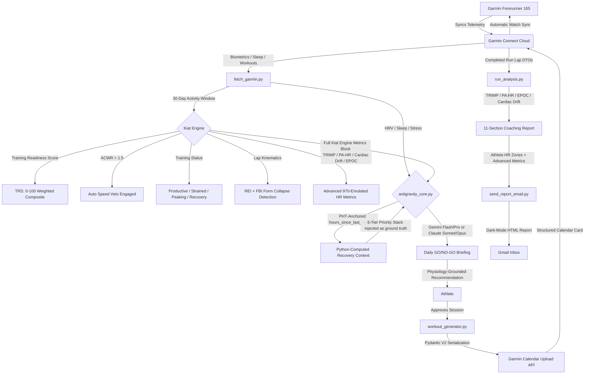

# 🏃‍♂️ Marathon Agent (`marathon-agent`)

> An autonomous physiological rules engine, biometric pipeline, and Garmin-compatible workout generator — powered by the **Kiat Engine**, a custom physiological intelligence layer emulating Forerunner 970-class metrics from Forerunner 165 telemetry, with deterministic LLM grounding to eliminate hallucination in recovery prescriptions.

[](https://www.python.org)
[](https://opensource.org/licenses/MIT)
[](https://connect.garmin.com)
[](https://docs.pydantic.dev/)
[](https://deepmind.google/technologies/gemini/)

`marathon-agent` is an intelligent personal coaching system that bridges the gap between raw biometric logs and real-world training execution. Co-engineered in partnership with an **AI Coding Agent**, it pulls physical data (HRV, Sleep Architecture, Strength Session Loads) from Garmin Connect, runs the **Kiat Engine** — a custom physiological intelligence layer — to compute premium coaching metrics beyond the athlete's hardware capabilities, and automatically generates and schedules structured, physiology-calibrated running workouts directly to the Garmin watch calendar.

---

## 🧬 Evolution, Origin & AI-Agent Collaboration

This system represents a major milestone in my development journey:

1. **The Origin:** The direct successor of my first-generation **Automated ETL Data Pipeline** (which passively loaded performance metrics into Google Sheets).
2. **The Innovation Gap:** Passive dashboards leave a gap — they don't actively adapt or prevent overtraining in real time. `marathon-agent` closes that gap with an active, autonomous coaching loop. As of **May 2026**, the Kiat Engine has been upgraded to emulate **Forerunner 970-class** advanced physiological stress metrics (TRIMP, PA:HR Decoupling, Cardiac Drift, Max HR Drop, EPOC) computed from raw lap DTOs — closing the hardware capability gap entirely through software.
3. **Solving LLM Temporal Hallucination *(New — May 2026)*:** LLMs are stateless and have no inherent sense of time — a critical failure mode for coaching systems where a 12-hour error in recovery estimation can mean the difference between a productive session and an overtraining injury. This architecture explicitly strips temporal reasoning away from the LLM. The Python layer computes a precise float for `hours_since_last_run_end` from exact Garmin `startTimeLocal + duration` timestamps (anchored to Philippine Time, UTC+8), then injects a hardcoded "Recovery Context" block into the LLM prompt as absolute, unalterable ground truth. The LLM is instructed never to reinterpret or override this block.
4. **Multi-LLM Backbone:** The system is not locked to a single model provider. The coaching brain switches between **Google Gemini** (Flash / Pro) and **Anthropic Claude** (Sonnet / Opus) depending on the session's complexity and depth required. This model-agnostic design ensures the best reasoning is always applied to the data.
5. **AI-Agent Co-Engineering:** Rather than manually writing thousands of lines of low-level API orchestration code, I acted as a **Systems Architect**, leveraging an advanced **AI Coding Agent (Antigravity)** to co-engineer, debug, and extend this production-grade pipeline. This project demonstrates the power of AI-assisted systems design, rapid prototyping, and iterative domain-specific engineering.

---

## 🧭 System Architecture & Data Flow



---

## ⚡ Core Features & Capabilities

### 🧠 1. Kiat Engine — Physiological Intelligence Layer ([physiological_engine.py](physiological_engine.py))

The flagship module. Named from the Hokkien word *Kiat* (傑) — meaning **to surpass, to go beyond**. The Kiat Engine computes premium physiological metrics from raw Forerunner 165 telemetry, completely bypassing hardware limitations through software intelligence. As of **May 2026**, it also emulates **Forerunner 970-class advanced HR and physiological stress metrics** — available in every daily briefing and sync report.

#### Training Readiness Score (TRS) — 0 to 100
A weighted composite index computed every morning before any training decision is made:

| Component | Weight | Source |
|---|---|---|
| Sleep History | 30% | Garmin native score or physiological heuristic fallback |
| Recovery Time | 25% | Linear decay model from last activity's recovery prescription |
| HRV Status | 20% | RMSSD overnight avg vs. 116 ms personal floor |
| Acute Training Load | 15% | ACWR-based: 100 inside sweet zone, decays outside |
| Daily Stress History | 10% | Garmin stress score (target ≤ 25) |

**TRS Categories:** `Prime (90–100)` → `Primed (75–89)` → `Moderate (50–74)` → `Low (25–49)` → `Depleted (<25)`

> **Sleep Heuristic Fallback:** When Garmin returns N/A for sleep score, a custom algorithm scores duration (target: 8h), deep sleep % (target: 15–25%), REM % (target: 20–25%), and awake time (target: ≤5%) to produce a physiologically grounded substitute.

#### Acute-to-Chronic Workload Ratio (ACWR)
Tracks progressive overload safety using a rolling 7-day vs. 28-day running distance window.

```
Acute Load   = Total running km over last 7 days
Chronic Load = Average weekly running km over last 28 days
ACWR         = Acute ÷ Chronic
```

| ACWR Zone | Label | Action |
|---|---|---|
| < 0.3 | Recovery | Very low stimulus |
| 0.3 – 0.79 | Taper/Underloading | — |
| **0.8 – 1.30** | **Sweet Spot** | **Optimal — safe to progress** |
| 1.31 – 1.49 | High | Reduce volume 3–5 days |
| **> 1.50** | **DANGER** | **Auto Speed Veto engaged** |

> **The Speed Veto:** Any ACWR > 1.50 autonomously blocks all interval, tempo, VO2Max, and heavy lower-body lift sessions — injecting a hard constraint directly into the LLM prompt with no override path.

#### Training Status Engine
A deterministic state machine classifying the athlete's current physiological state each session:

`Productive` · `Peaking / Tapering` · `Maintaining` · `Recovery` · `Strained / Overreaching` · `Unproductive`

#### Running Economy Index (REI) & Fatigue Biomechanics Index (FBI)
- **REI:** Computes `Speed (m/s) ÷ Normalized Power (W) × 1000` over Zone 2 laps (145–162 bpm). Falls back to HR-based economy when power data is unavailable.
- **FBI:** Compares kinematic data (cadence, stride length, ground contact time) between the first and last 3 active laps. A score below 70 triggers a form collapse flag, blocking interval prescriptions for the next session.

#### Advanced HR & Physiological Stress Metrics (Forerunner 970-Emulated) *(New — May 2026)*
Computed directly from lap telemetry and injected into every daily briefing and sync report:

| Metric | Formula | What It Measures |
|---|---|---|
| **TRIMP (Banister)** | `duration_min × dHR_ratio × 0.64 × e^(1.92 × dHR_ratio)` | True cardiovascular training stress in AU |
| **Edwards TRIMP** | Zone-weighted minutes (Z1×1 … Z5×5) | Cross-check via zone distribution |
| **PA:HR Decoupling** | `(EF_first_half - EF_second_half) / EF_first_half × 100` | Aerobic ceiling test — is HR drifting from pace? |
| **Cardiac Drift (Absolute)** | First-third vs last-third avg HR delta | Heat-driven plasma volume loss signal (bpm) |
| **Cardiac Drift Index** | HR/speed ratio first vs last quarter | Pace-controlled drift — isolates thermal from effort |
| **Max HR Drop** | Largest consecutive-lap HR decrease | Walk break / cooling event detector |
| **EPOC (Knuttgen)** | `0.096 × e^(0.0284 × %HRmax) × duration_min` | Session-level O2 recovery debt (mL/kg) |
| **Per-Lap EPOC %** | `(HR/HRmax)² × duration` normalized | Relative contribution of each lap to total EPOC |

---

### 🔍 2. Biometric Ingestion & MFA Caching ([fetch_garmin.py](fetch_garmin.py))
- Connects securely to Garmin Connect via reverse-engineered endpoints.
- **Token Caching:** Stores OAuth session tokens in `~/.garminconnect` after the initial execution, bypassing repetitive MFA prompts on every run.
- Pulls sleep stage breakdowns (Deep, Light, REM, Awake %), HRV, body battery, resting HR, and nutrition balance.
- **Expanded to a 30-day activity window** (35 activities) to power the ACWR chronic workload baseline.
- Runs the physiological engine at the end of every sync — printing the full 970-emulated metrics report.

---

### 🤖 3. AI Daily Briefing ([antigravity_core.py](antigravity_core.py))

The execution core. Connects to a **multi-LLM backend** (Google Gemini Flash/Pro or Anthropic Claude Sonnet/Opus) with a highly structured, deterministic system prompt. The key architectural decision is that the LLM is the *narrator*, not the *calculator* — all safety-critical decisions are pre-computed in Python before the model ever sees the data.

#### ⏱️ PHT-Anchored Temporal Engine *(New — May 2026)*
All date/time logic is anchored to **Philippine Time (UTC+8)** via a module-level constant:
```python
PHT = timezone(timedelta(hours=8))
```
The script fetches `startTimeLocal + duration` from Garmin to compute the **exact workout end time** in PHT, then derives:
```python
hours_since_last_run_end = (now_pht - end_pht).total_seconds() / 3600.0
```
This float is the **PRIMARY RECOVERY SIGNAL** — displayed in the briefing header and used to gate all coaching decisions.

#### 🔢 6-Tier Recovery Gate *(New — May 2026)*
Replaces the previous coarse day-bucket logic. All thresholds are hours-based and operate on the exact workout end time:

| Hours Since Run Ended | Recovery State | Coaching Rule |
|---|---|---|
| < 6h | Just Finished | Zone 1 or complete rest ONLY |
| 6 – 24h | Within 24h | Zone 1-2 MAXIMUM. No Zone 3/4/5 regardless of HRV/TRS |
| 24 – 36h | ~1 Day | Zone 2 safe. Zone 3-4 ONLY if last run was < 15 km easy |
| 36 – 48h | ~2 Days | Zone 3-4 cleared if HRV ≥ 116 ms & TRS green. Zone 5 blocked unless last run < 15 km |
| 48 – 72h | ~3 Days | All zones permitted — defer to TRS, HRV, ACWR |
| > 72h | Extended Rest | Full clearance. Detraining risk if gap > 5 days |

#### 🧱 Hardcoded Priority Stack *(New — May 2026)*
The LLM is forced to evaluate all gates in strict order before forming a recommendation:

| Priority | Gate | Rule |
|---|---|---|
| P1 | ACWR Veto | ACWR > 1.5 → automatic Speed Veto. No debate. |
| P2 | HRV Gate | HRV < 116 ms → No Zone 4/5 or heavy lower-body |
| P3 | Recovery Gate | hours_since_last_run_end mapped to 6-tier table above |
| P4 | TRS Advisory | TRS < 50 → Downgrade all sessions to Zone 2 max |
| P5 | Biomechanics | FBI < 70 → Shorten session, add mobility work |
| P6 | Standard | Training Status guides periodisation prescription |

The LLM receives the Python-computed Recovery Context as a labeled block with the instruction: *"Do NOT reinterpret or override this block. It is pre-computed from exact PHT timestamps by the Python layer."*

#### Output Structure
Every briefing produces 5 sections:
1. **GO / NO-GO** — cites specific metric values and the P3 tier hit
2. **Training Status** — state + metric combination that produced it
3. **REI & FBI Commentary** — flags form collapse or economy regression
4. **Today's Session Recommendation** — session type, target HR zone, duration, justification
5. **Recovery Outlook** — tomorrow's training window based on today's prescription

---

### 🛠️ 4. Pydantic V2 Workout Generator ([workout_generator.py](workout_generator.py))
- Constructs complex running workouts (warmup, work intervals, recovery intervals, cooldowns) programmatically.
- Serializes API-compliant payloads using **Pydantic V2**, bypassing Garmin's inaccurate automatic HR zone tables by sending precise absolute BPM targets and speed metrics (m/s).
- Schedules workouts directly to specific dates on the Garmin Connect Calendar.

---

### 🔴 5. Physiological Safety Rules ("Red Lines")
- **The HRV Gate:** 7-day RMSSD < 116 ms → vetoes Zone 4/5 sessions → schedules Zone 1/2 recovery.
- **The ACWR Speed Veto:** ACWR > 1.50 → autonomous block on all high-intensity work.
- **The Chassis Rule:** Heavy lifts (Squat ≥ 105 kg or Deadlift ≥ 130 kg) → enforces 6–24h buffer before speed runs.
- **Zone-2 Heat Cap:** Strict 162 BPM ceiling for base runs accounting for Marikina tropical climate cardiac drift.
- **FBI Form Collapse:** FBI < 70 → next session shortened; intervals blocked.

---

### 📐 6. Post-Workout Biomechanics Auditor
Per-lap decoding of Garmin telemetry for completed runs:
- Cadence (spm), stride length (m), Ground Contact Time (ms), Vertical Oscillation (cm), Vertical Ratio (%)
- Normalized Power (W) and W/kg per lap
- Grade Adjusted Pace (GAP) and moving pace delta

---

### 📈 7. Rolling Block Auditor ([block_auditor.py](block_auditor.py))
- Retro audits over rolling 3-week training blocks.
- Week-over-week deltas: running volume, longest run, elevation gain, cross-training distance, strength presence.

---

### 🔬 8. Exhaustive Run Analysis Engine ([run_analysis.py](run_analysis.py)) *(New — May 2026)*
A coaching-grade, lap-by-lap post-run analytics report generator. Pulls every available field from the Garmin API and computes advanced metrics entirely absent from Garmin's native platform:

| Metric | Formula | What It Measures |
|---|---|---|
| **TRIMP (Banister)** | `duration × ΔHR_ratio × 0.64 × e^(1.92 × ΔHR_ratio)` | True cardiovascular training stress in AU |
| **Edwards TRIMP** | Zone-weighted minutes (Z1×1 … Z5×5) | Cross-check training load via zone distribution |
| **PA:HR Decoupling** | `(EF_first_half - EF_second_half) / EF_first_half × 100` | Whether HR drifted away from pace — aerobic ceiling test |
| **Cardiac Drift Index** | HR/pace ratio (bpm per m/s), first vs last quarter | Heat-corrected drift, controls for pace changes |
| **Max HR Drop** | Largest consecutive-lap HR decrease | Detects walk breaks and cooling events |
| **EPOC (Knuttgen)** | `0.096 × e^(0.0284 × %HRmax) × duration_min` | Session-level oxygen recovery debt (mL/kg) |
| **Per-Lap EPOC %** | `(HR/HRmax)² × duration` normalized | Relative contribution of each lap to EPOC |

- Uses **Max's verified personal HR zones** (from `operating_manual.md`) — never Garmin's inaccurate native zones.
- Generates a full Markdown report covering 11 sections: Activity Overview, Environmental Conditions (Heat Tax), HR Analysis, Power Analysis, Training Effect, Biomechanics, Best Efforts, and exhaustive lap-by-lap table with all 18+ fields per lap.
- Accepts a date argument: `python run_analysis.py 2026-05-23`

---

### 📧 9. Automated HTML Email Report ([send_report_email.py](send_report_email.py)) *(New — May 2026)*
Sends a professionally designed dark-mode HTML email directly to the athlete's Gmail after every significant session. Includes:
- Kiat Engine vitals dashboard (TRS, ACWR, HRV, Training Status)
- Advanced HR metrics block (TRIMP, PA:HR, Cardiac Drift, EPOC, Max HR Drop)
- Full color-coded lap table with real HR zone classification
- Phase-by-phase narrative analysis
- Placeholder weekly training plan with daily ACWR-conditional override notes
- Delivered via Gmail SMTP with App Password authentication

---

## 📦 Directory Structure

```
marathon-agent/
├── physiological_engine.py   # Kiat Engine -- TRS, ACWR, Training Status, REI, FBI, 970-emulated metrics
├── antigravity_core.py       # AI daily briefing -- Multi-LLM + PHT-anchored deterministic recovery gate
├── fetch_garmin.py           # Biometric ingestion -- 30-day window, sleep, HRV, nutrition
├── workout_generator.py      # Pydantic V2 workout builder & Garmin Calendar uploader
├── run_analysis.py           # Exhaustive run analytics -- TRIMP, EPOC, PA:HR, Cardiac Drift
├── send_report_email.py      # Automated dark-mode HTML email report via Gmail SMTP
├── block_auditor.py          # 3-week rolling block audit & volume delta analysis
├── audit_14d.py              # 14-day retrospective analytics script
├── knowledge_base/
│   ├── operating_manual.md   # Athlete profile, thresholds, Kiat Engine rules (Sections 1-7)
│   ├── 80_20_running.md
│   ├── maintenance_and_weight_loss.md
│   ├── speed_and_endurance_development.md
│   └── ...                   # Additional reference materials
├── .env.example              # Environment variable template
└── .gitignore                # Excludes credentials, tokens, and cache files
```

---

## 🛠️ Getting Started

### Prerequisites
- Python 3.10 or higher
- A Garmin Connect account
- A Google Gemini API key **or** an Anthropic API key (system is multi-LLM)

### Installation & Setup

**Clone the repository:**
```bash
git clone https://github.com/maxxsotelo/marathon-agent.git
cd marathon-agent
```

**Install dependencies:**
```bash
pip install garminconnect google-genai anthropic python-dotenv pydantic
```

**Create a `.env` file in the root directory:**
```env
GARMIN_EMAIL="your_garmin_email@example.com"
GARMIN_PASSWORD="your_secure_password"
GEMINI_API_KEY="your_gemini_api_key"
# ANTHROPIC_API_KEY="your_claude_api_key"  # Optional: for Claude Sonnet/Opus sessions
GMAIL_SENDER="your_gmail@gmail.com"
GMAIL_APP_PASSWORD="your_gmail_app_password"
GMAIL_RECIPIENT="your_email@gmail.com"
```

> **Security Note:** The `.gitignore` is pre-configured to exclude `.env`, `~/.garminconnect` token files, and all cache/output files. Your credentials will never be committed.

---

## 🚀 Usage

### Daily Biometrics Sync + Kiat Engine Report
```bash
python fetch_garmin.py
```
Pulls all Garmin data, prints a full biometrics audit, and outputs the Kiat Engine metrics (TRS, ACWR, Training Status, REI, FBI) at the end.

*On first execution, enter the Garmin MFA code. All subsequent runs use the cached token automatically.*

### AI Daily Briefing (GO / NO-GO + Session Recommendation)
```bash
python antigravity_core.py
```
Fetches live telemetry, runs the physiological engine, computes exact hours elapsed since last run (PHT-anchored), applies the 6-tier recovery gate and priority stack, consults the configured LLM (Gemini or Claude), and outputs a full clinical coaching briefing with training status, biomechanics commentary, and a specific session recommendation.

### Generate and Upload a Workout to Garmin Calendar
```bash
python workout_generator.py
```

### 3-Week Rolling Block Audit
```bash
python block_auditor.py
```

### Exhaustive Run Analysis Report
```bash
# Analyze yesterday's run (default)
python run_analysis.py

# Analyze a specific date
python run_analysis.py 2026-05-23
```
Fetches all lap telemetry from Garmin Connect, computes TRIMP, PA:HR decoupling, Cardiac Drift, EPOC, and Max HR Drop using the athlete's verified personal zones. Outputs an 11-section Markdown coaching report.

### Send Weekly Report Email
```bash
python send_report_email.py
```
Generates a dark-mode HTML email with the full run analysis, Kiat Engine vitals, advanced HR metrics, and the weekly training plan, then sends it to the configured Gmail address via SMTP App Password.

---

## 🧪 Kiat Engine Self-Test
```bash
python physiological_engine.py
```
Runs a built-in simulation with synthetic telemetry to verify all scoring functions, ACWR calculations, state machine transitions, and FBI form collapse detection. No Garmin connection required.

---

## 📄 License
This project is licensed under the MIT License — see the [LICENSE](LICENSE) file for details.
